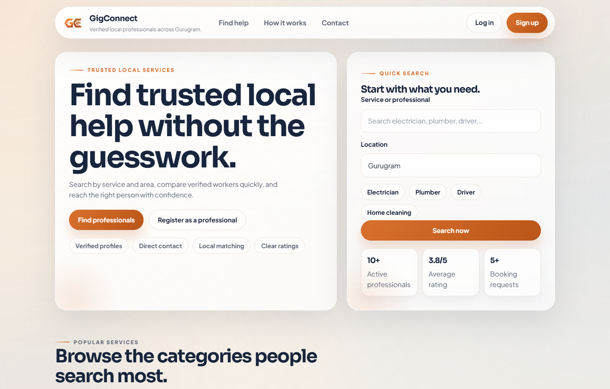
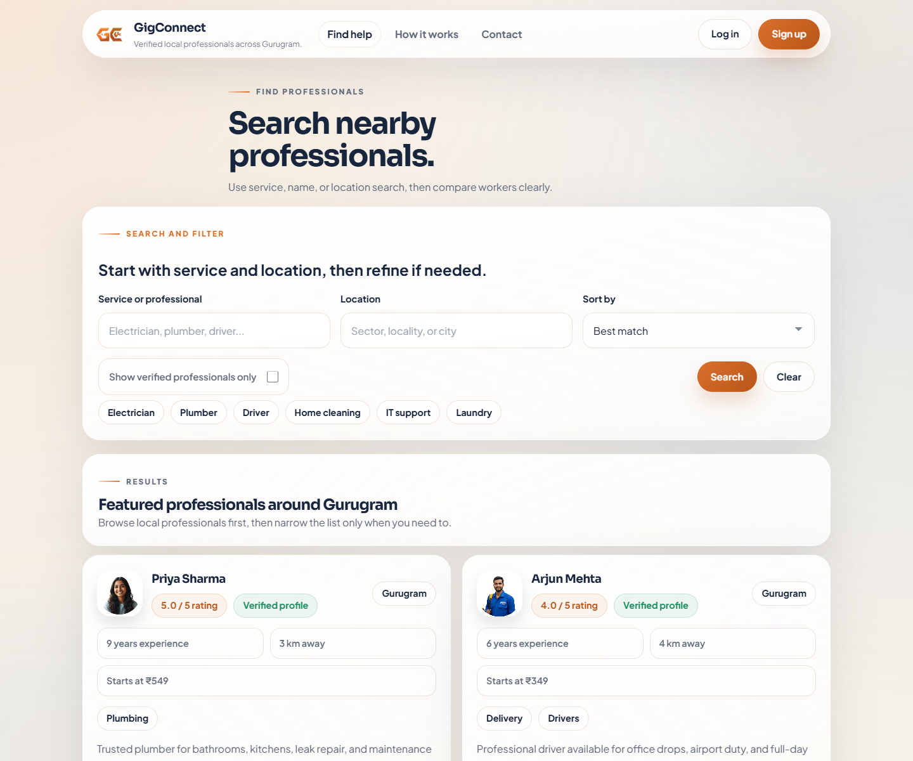
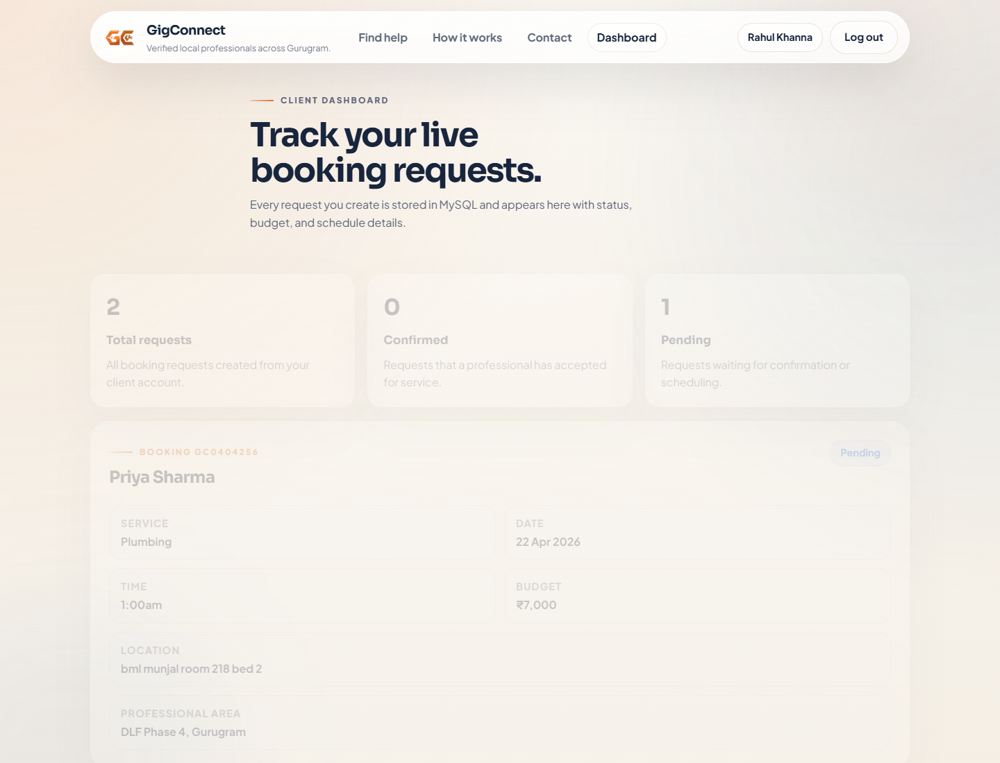
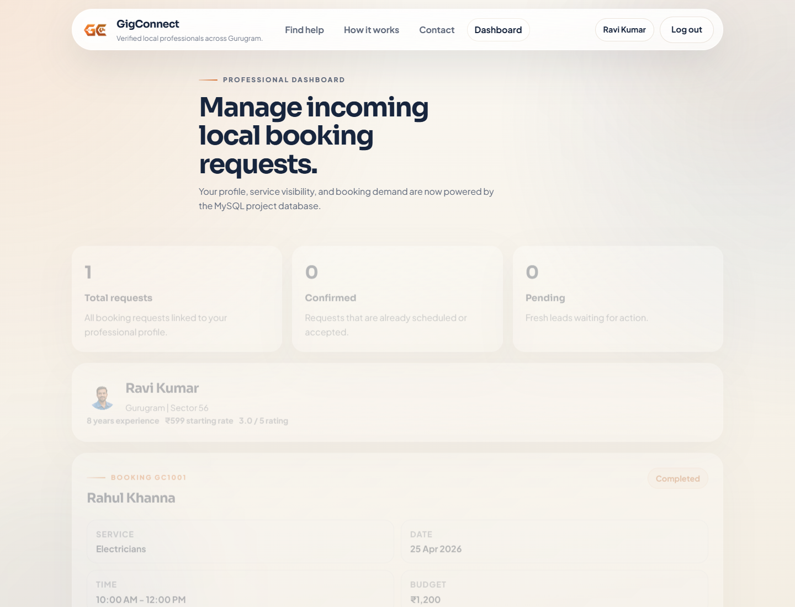

# GigConnect

GigConnect is a full-stack local services marketplace for Indian users. It helps clients discover nearby professionals, compare service options, create booking requests, and manage activity through dedicated client and professional dashboards.

## Overview

- Search local professionals by service and location
- Compare pricing, experience, ratings, and verification
- Create booking requests with INR budgets
- Manage live booking status through role-based dashboards
- Submit and display reviews after completed services
- Store contact form data, accounts, bookings, and reviews in MySQL

## Screenshots

### Home



### Professional Search



### Client Dashboard



### Professional Dashboard



## Core Features

### Public experience

- Premium landing page with quick search
- Service discovery and featured professionals
- Contact page for inquiries

### Client experience

- Client signup and login
- Booking request creation
- Dashboard for tracking request status
- Rating and review submission for completed services

### Professional experience

- Professional registration and login
- Service mapping with pricing
- Dashboard for incoming requests
- Booking status updates for pending and confirmed work

## Tech Stack

- Node.js
- Express.js
- EJS
- MySQL 8
- Express Session
- bcryptjs

## Project Structure

- `app.js` - Express app entry point and routes
- `views/` - EJS pages, layout, and partials
- `public/` - static assets, frontend JavaScript, and styling
- `lib/` - MySQL access and application data helpers
- `data/` - content and seed data
- `database/schema.sql` - reference schema for the database

## Local Setup

1. Clone the repository
2. Install dependencies
3. Copy `.env.example` to `.env`
4. Add your local MySQL credentials
5. Make sure MySQL is running
6. Start the app

```bash
npm install
npm start
```

Open:

```text
http://localhost:3000
```

## Environment Variables

Create a `.env` file using `.env.example` and configure:

```env
PORT=3000
SESSION_SECRET=your-secret
MYSQL_HOST=localhost
MYSQL_PORT=3306
MYSQL_USER=root
MYSQL_PASSWORD=your-password
MYSQL_DATABASE=dbmsproject
```

## Demo Accounts

### Client

- Email: `rahul.khanna@gigconnect.in`
- Password: `Client@123`

### Professional

- Email: `ravi.kumar@gigconnect.in`
- Password: `Pro@123`

## Database Notes

- The app bootstraps the `dbmsproject` database automatically when valid MySQL credentials are available.
- If MySQL is unavailable, the UI can still open in limited fallback mode.
- Live authentication, bookings, reviews, and contact storage require a working MySQL connection.

## Highlights

- Indian service categories and INR pricing
- Role-based client and professional flows
- Dynamic MySQL-backed search, booking, and dashboard data
- Clean EJS structure with reusable layouts and partials
